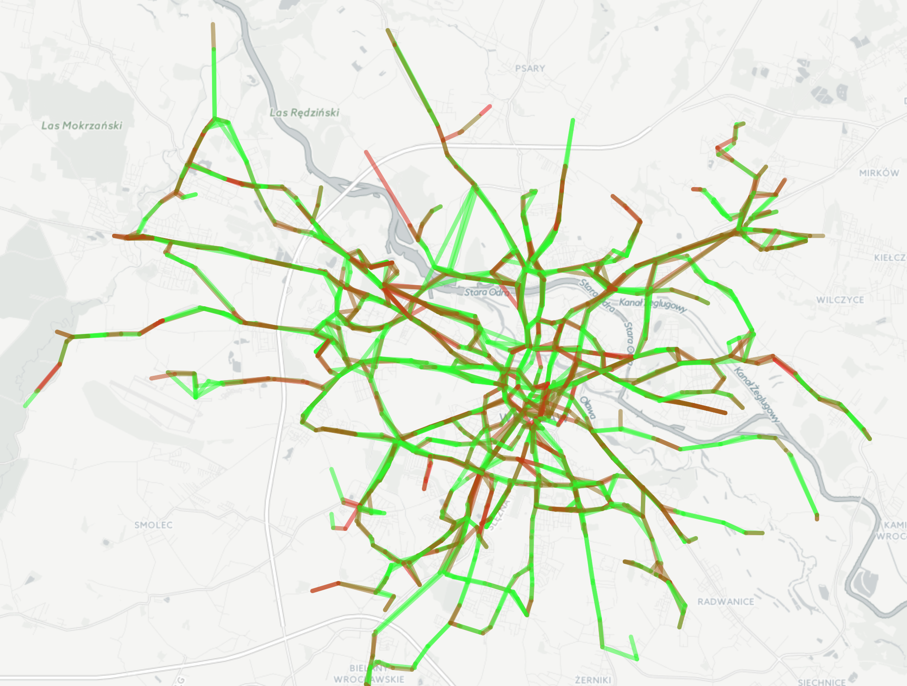
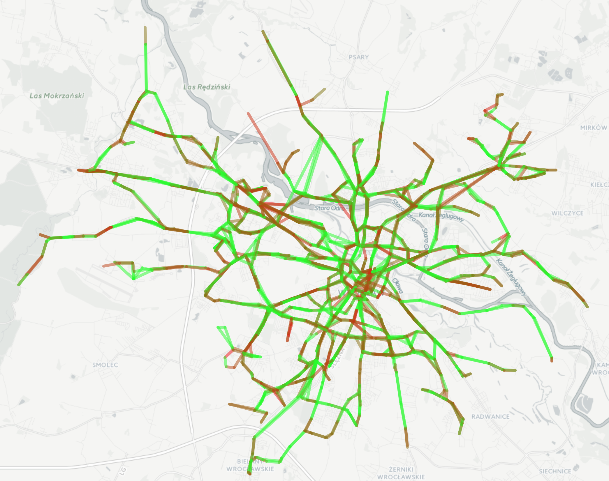

<b>datathon.wroclaw.2016</b>

<b>Dane</b>

Działaliśmy (ja oraz [Mateusz Dryzek](https://github.com/matdryz)) na zbiorze danych zawierającym lokalizacje oraz opóźnienia komunikacji miejskiej we Wrocławiu pomiędzy 17.11 i 01.12. Zbiór został nam udostępniony przez Piotra Oleszczyka.

<b>Preprocessing, agregacja</b>

- zbudowanie grafu: opóźnienie kursu aktualizowane jest na każdym przystanku, więc zmiana tego opóźnienia ma swoje źródło na krawędzi między dwoma przystankami: tym na który tramwaj ostatnio wjechał oraz poprzednim. Pierwszym wykonanym przez nas krokiem było przejście przez wszystkie dane, znalezienie momentów zmian ostatnio odwiedzonego przystanku, obliczene różnicy opóźnień i przypisanie tych wartości do odpowiedniej pary przystanków

- wymiary czasu: dla każdego miejsca powstania opóźnienia dodaliśmy 2 dodatkowe cechy, po których później dane filtrujemy: typ dnia tygodnia (2 wartości: poniedziałek-piątek oraz sobota-niedziela) i pora dnia (7-10, 11-16, 17-20, 21-0, 1-6)

- dla każdej krawędzi obliczyliśmy średnią zmianę opóźnienia na niej

<b>Wizualizacja</b>

Krawędzie pokazaliśmy na mapie (współrzędne przystanków wydobyliśmy z plików GTFS udostępnionych przez miasto). Kolor krawędzi jest zależny od średniego opóźnienia na niej - dla wartości <= 0 kolor jest zielony, dla większych zbliża się do koloru czerwonego.

<b>Efekty</b>

Powstałe grafy (wraz ze średnimi wartościami opóźnień powstających na krawędziach) wskazują te odcinki między przystankami, na których często powstają opóźnienia. Linki prowadzą do plików html zawierających interaktywne mapy, po kliknięciu na krawędź możemy odczytać średnią wartość opóźnienia. Ten sam kolor krawędzi na obu mapach reprezentuje identyczną wartość średniego opóźnienia.

[Godziny szczytu (7-10) poniedziałek-piątek (HTML)](datathon.wroclaw.2016/workday.7-10.html)

[Godziny pracy (11-16) poniedziałek-piątek (HTML)](datathon.wroclaw.2016/workday.11-16.html)

